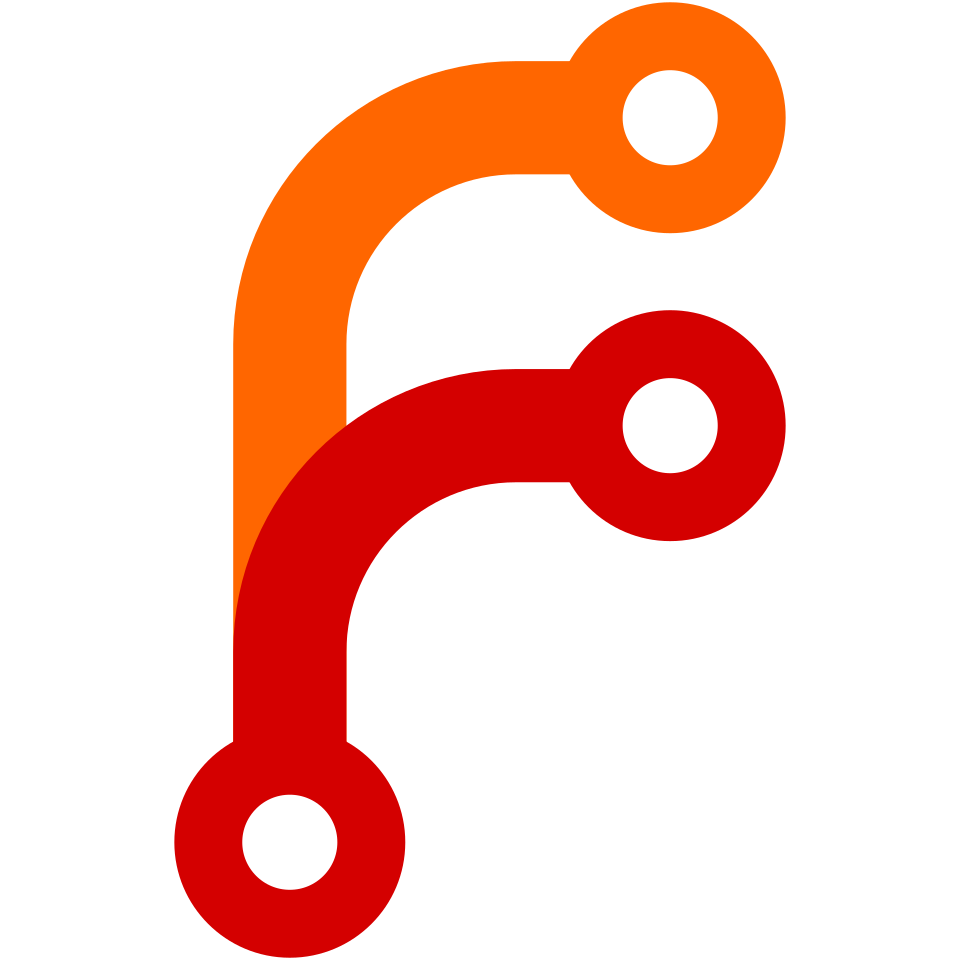

<h1 align="center">
  <sub>
    
  </sub>
  LibreShield
</h1>

A privacy-focused, free, and open-source content blocker for Firefox and other Gecko-based browsers. Block unwanted websites and keywords, manage exceptions, and protect your settings, all stored locally on your device.

---

## Get LibreShield

**LibreShield is available through multiple different sources.**

<style>
  .badge-link {
    display: flex;
    text-decoration: none;
    border: 1px solid #232323;
    border-radius: 1px;
    overflow: hidden;
    height: 32px;
    margin-right: 6px;
  }

  .badge-logo {
    display: flex;
    align-items: center;
    justify-content: center;
    padding: 0 8px;
    background-color: #323232; 
    border-right: 1px solid #232323;
  }

  .badge-text {
    display: flex;
    align-items: center;
    padding: 0 8px;
    background-color: #3d3d3d;
    color: #ffffff;
    font-size: 13px;
  }
  .badge-container {
    display: flex;
    flex-wrap: wrap;
    align-items: center;
    margin-top: 8px;
  }
</style>

<div class="badge-container">

  <a href="https://libreshield.goodkovsky.com/" class="badge-link">
    <div class="badge-logo"></div>
    <div class="badge-text">Website</div>
  </a>

  <a href="https://addons.mozilla.org/en-US/firefox/addon/libreshield/" class="badge-link">
    <div class="badge-logo"></div>
    <div class="badge-text">Mozilla Add-ons Store</div>
  </a>

  <a href="https://git.goodkovsky.com/gleb/libreshield.git" class="badge-link">
    <div class="badge-logo"></div>
    <div class="badge-text">Forgejo (Main)</div>
  </a>

  <a href="https://codeberg.org/GlebGoodkovsky/libreshield.git" class="badge-link">
    <div class="badge-logo"></div>
    <div class="badge-text">Codeberg (Mirror)</div>
  </a>

  <a href="https://github.com/GlebGoodkovsky/libreshield.git" class="badge-link">
    <div class="badge-logo"></div>
    <div class="badge-text">GitHub (Mirror)</div>
  </a>

</div>

---

## Privacy & Security

LibreShield is built with privacy as a core principle.

-   **No Cloud, No Tracking**: All your data is stored locally in your browser. Nothing is ever sent to any external server.
-   **Strong Password Protection**: Your settings can be protected with a password. The password is never stored directly — it is hashed using PBKDF2 with 100,000 iterations, SHA-256, and a random salt, an industry-standard method that makes it extremely difficult to reverse.
-   **Brute-Force Lockout**: After too many incorrect password attempts, access is locked for 5 minutes. The lockout persists even if the settings page is closed and reopened.
-   **Safe Exports**: When exporting your settings, password data is automatically excluded from the backup file.
-   **Privacy Policy**: See [PRIVACY.md](https://github.com/glebgoodkovsky/libreshield/blob/main/PRIVACY.md) for a full breakdown of permissions and data handling.

---

## Features

-   **Comprehensive Blocking**
    -   **Domain Blocking**: Block entire websites by domain (e.g. `example.com`).
    -   **Keyword Blocking**: Scan page content and block pages that contain specific words or phrases.

-   **Temporary Access**
    -   **Timed Unblocks**: From the block page, request temporary access to a blocked site or keyword for a set number of minutes.
    -   **Password Gated**: Temporary access requires your password, preventing easy bypasses.
    -   **Manage Active Unblocks**: View and revoke all active temporary permissions from the settings page.

-   **Site Allowlist**
    -   Mark trusted sites that always bypass blocking rules, regardless of your keyword or domain lists.

-   **Secure Settings**
    -   Protect your settings page with a password to prevent unauthorized changes.
    -   Change or remove your password at any time from within the settings.

-   **User-Friendly Interface**
    -   **Toggle Blocking On/Off**: Quickly enable or disable all blocking from the popup.
    -   **One-Click Site Actions**: Block or allow the current website directly from the popup.
    -   **Customizable Block Page**: Set your own message to display when a page is blocked.
    -   **Light & Dark Theme**: Switch between themes from the settings page.

-   **Data Management**
    -   **Export & Import**: Back up your full configuration to a JSON file and restore it any time. Password data is excluded from exports for security.

-   **Firefox & LibreWolf Focused**
    -   Built on standard WebExtension APIs for full compatibility with Firefox, LibreWolf, and other Gecko-based browsers.

---

## How It Works

LibreShield is built with plain web technologies and the WebExtensions API - no frameworks, no dependencies.

-   **HTML/CSS**: Structures and styles the popup, settings page, and block page, with full light and dark theme support.
-   **JavaScript (Vanilla)**: Powers all logic across four main scripts:
    -   `background.js`: Handles web request blocking using an in-memory cache for reliable, synchronous decisions. Also manages password verification, temporary unblock timers, and scheduled cleanup via the `alarms` API.
    -   `content.js`: Runs on every page to scan for blocked keywords and communicates with the background script to trigger blocking.
    -   `popup/popup.js`: Manages the toolbar popup — toggle blocking, block or allow the current site.
    -   `options/options.js`: Handles the full settings page including authentication, list management, password management, and import/export.
-   **WebExtensions API**: Uses `storage`, `webRequest`, `webRequestBlocking`, `tabs`, `runtime`, and `alarms`.

---

## Running Locally (Development)

1. **Clone the repository:**

You can clone this project from either the primary self-hosted instance or the GitHub mirror:

**From Self-Hosted (Primary):**

```bash
git clone https://git.goodkovsky.com/gleb/libreshield.git
```

**From GitHub (Mirror):**

```bash
git clone https://github.com/glebgoodkovsky/libreshield.git
```

2. **Navigate into the directory:**

```bash
cd libreshield
```


3.  **Load as a Temporary Add-on in Firefox or LibreWolf:**
    -   Go to `about:debugging#/runtime/this-firefox` in your browser.
    -   Click **Load Temporary Add-on...**.
    -   Select the `manifest.json` file from the project folder.

The extension will appear in your toolbar. Note that temporary add-ons are removed when the browser is closed.

---

## Contributing

Bug reports, suggestions, and pull requests are welcome. Feel free to open an issue to discuss anything.

---

## License

MIT — see [LICENSE](LICENSE) for details.

---

## A Note on Development

This project was built as a hands-on exercise in WebExtension development. An AI assistant was used as a coding partner throughout, helping write, debug, and improve the code while I learned the fundamentals. The goal was always to understand what was being built.

---

This repository is primarily hosted at [git.goodkovsky.com](https://git.goodkovsky.com/gleb/libreshield) and is mirrored to GitHub for visibility.

---